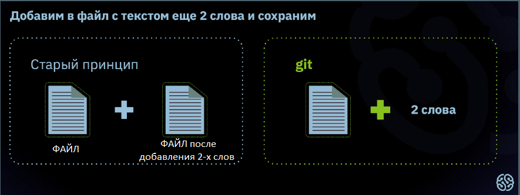
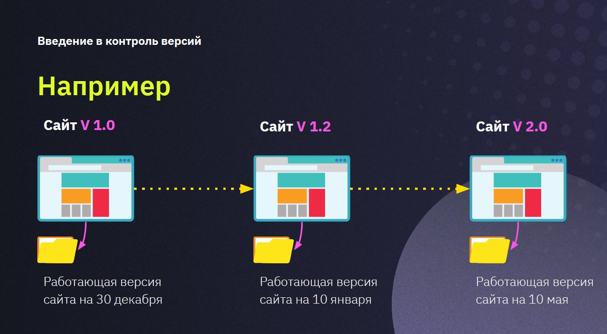

# **GIT**

## _Содержание:_

1. Что такое Git и как он работает
2. Возможности
3. Примеры контроля версий
4. Начало работы и некоторые команды Git
___

### *__Что такое Git и как он работает__*

Автор программы — **<code>[Линус Торвальдс](https://ru.wikipedia.org/wiki/Торвальдс,_Линус)</code>**, создатель ОС Linux. Подробнее об авторе можно прочиать по ссылке.

Git - это программа, которая берет на себя вопросы контроля версий над проектом. Она самая популярная, но не единственная. Стоит обратить внимание на то, что Git сохраняет в памяти не файлы целиком, а разницу между ними.

*Например:*

### *__Возможности:__*

Git необхоим, чтобы:

* хранить разные версии проекта
* возвращаться к разным версиям проекта

Хранение версий сводится к созданию копий информации на компьютере или сервере. Функцию возврата реализуют за счёт восстановления предыдущих версий.

Таким образом, система контроля — это реализованная возможность замены информации с использованием сохраненных версий.

> Когда вы работаете в команде, контроль версий помогает синхронизировать усилия.

### *__Примеры контроля версий:__*

Самый распространенный пример из жизни - это возможность сохраниться в компьютерной игре.

Также, пример можно представить в следующем виде:

